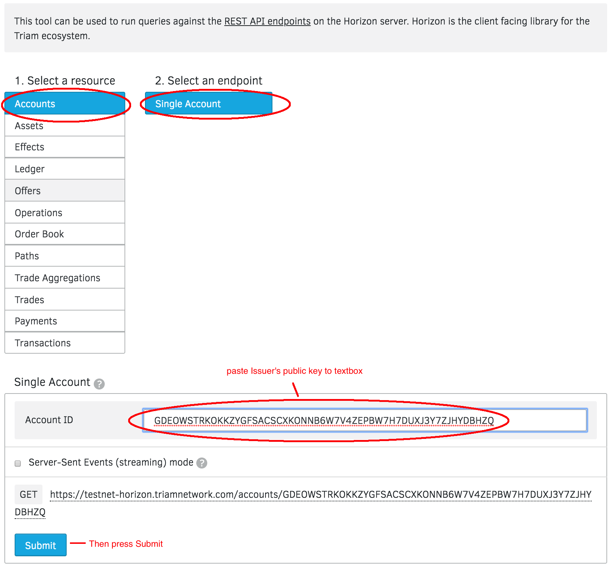
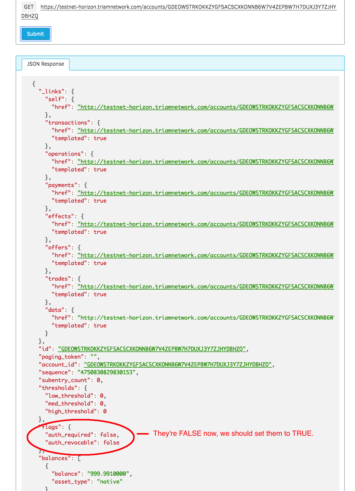
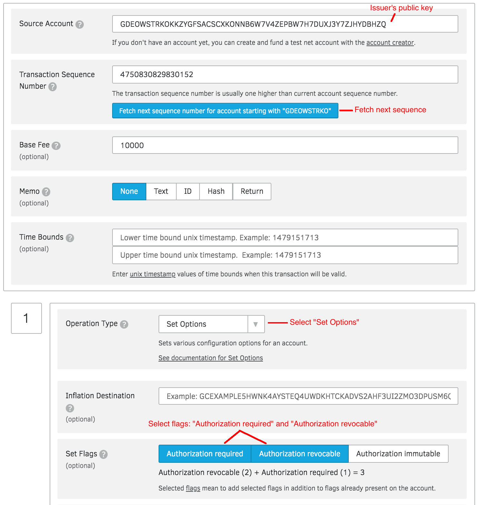
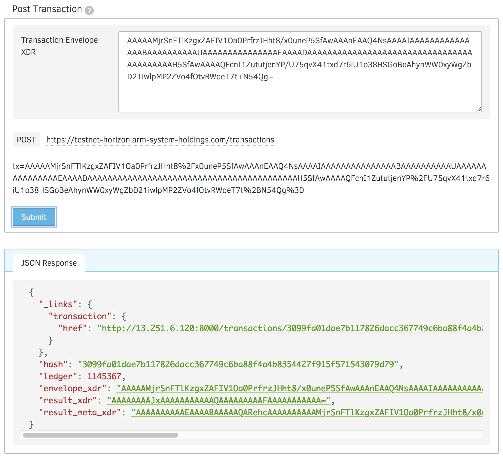
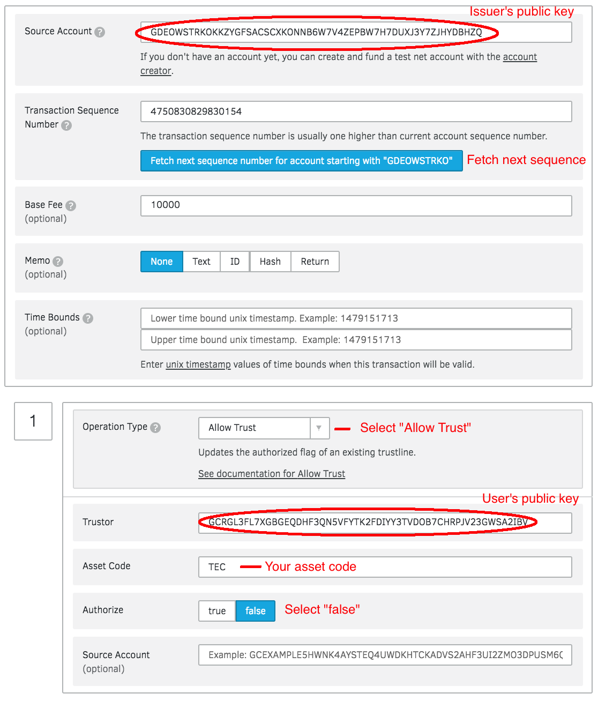

################################################################################
Freezing Assets
################################################################################

Foreword
--------------------------------------------------------------------------------

By default, anyone can create a trustline with an asset issuer to accept an asset. However, as an anchor, you can explicitly authorize and revoke user access to your asset by enabling the following flags on your issuing account.

* **AUTHORIZATION REQUIRED**: with this setting, the anchor must approve anyone who wants to hold its asset, allowing it to control who its customers are. Approving is done by the anchor by setting the Authorize flag of an existing trustline to true with the Allow Trust operation.
* **AUTHORIZATION REVOCABLE**: with this setting, the anchor can set Authorize flag of existing trustline to false with the Allow Trust operation, to freeze the asset held by another account. When an asset is frozen for a particular account, that account can’t transfer the asset to any other account, not even back to the anchor. This setting allows the issuing account to revoke assets that it accidentally issued or that were obtained improperly. To use this setting, AUTHORIZATION REQUIRED must also be enabled.

Example flow for an account with AUTHORIZATION REQUIRED and AUTHORIZATION REVOCABLE enabled:

1. User decides he/she wants to accept an asset
2. User opens a trust line with this asset’s issuing account
3. Issuer authorizes the user’s trustline
4. User can accept and send the asset to whomever else has a trustline open with the issuer
5. Issuer wants to freeze user’s access to asset
6. Issuer deauthorizes user’s trustline
7. User cannot send or accept this asset

Now, let's freeze an asset on test network:

Asset details:

* **Issuer**: GDEOWSTRKOKKZYGFSACSCXKONNB6W7V4ZEPBW7H7DUXJ3Y7ZJHYDBHZQ
* **Asset Code**: TEC
* **Asset Type**: credit_alphanum4

Step 1: Check the flags of Issuer
--------------------------------------------------------------------------------

Make sure issuer's flags: "**auth_required**" and "**auth_revocable**" are TRUE

Now go to `Endpoint Explorer <https://www.stellar.org/laboratory/#explorer?resource=accounts&endpoint=single&network=test>`_

Step 2: Set flags to *True*
--------------------------------------------------------------------------------

Go to `Transaction Builder <https://www.stellar.org/laboratory/#txbuilder?network=test>`_, this is what that operation looks like:

* **Source Account**: Issuer's public address
* **Operation Type**: Set Options
* **Set Flags**: "Authorization required" and "Authorization revocable"

Then sign transaction and submit to the network.

If all goes well, you’ll see a successful transaction like so:

Now go to `Step 1 <https://how-to-use-laboratory.readthedocs.io/en/latest/lock.html#step-1-check-the-flags-of-issuer>`_ to re-check statuses.

Step 3: Deauthorizes User’s Trustline
--------------------------------------------------------------------------------

Go to `Transaction Builder <https://www.stellar.org/laboratory/#txbuilder?network=test>`_, this is what that operation looks like:

* **Source Account**: Issuer's public address
* **Operation Type**: Allow Trust
* **Trustor**: User's public key that you want to freeze the asset
* **Asset Code**: e.g. TEC
* **Authorize**: false

Then sign transaction and submit to the network.

Finally, User cannot send or accept this asset.
