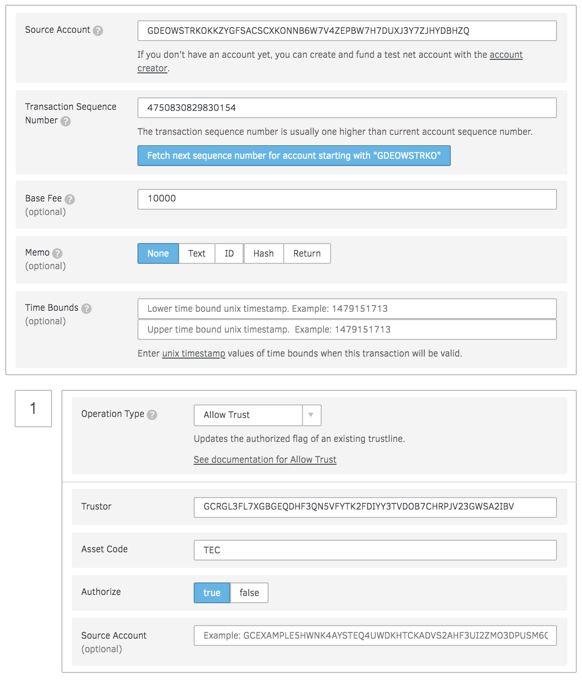

################################################################################
Un-Freezing Assets
################################################################################

Go to `Transaction Builder <https://www.stellar.org/laboratory/#txbuilder?network=test>`_, this is what that operation looks like:

* **Source Account**: Issuer's public address
* **Operation Type**: Allow Trust
* **Trustor**: User's public key that you want to un-freeze the asset
* **Asset Code**: e.g. TEC
* **Authorize**: true

Then sign transaction and submit to the network.

Now, User can send or accept this asset.
